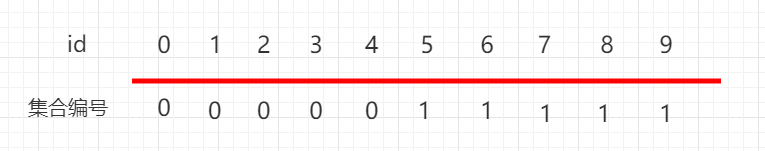

# 并查集（Union-Find）数据结构

## 1. 什么是并查集？

并查集是一种用于处理不相交集合的数据结构，它支持两种主要操作：
- **Union（合并）**：合并两个不相交的集合
- **Find（查找）**：查询某个元素所在的集合

## 2. 应用场景

- **检测图中的环**：在无向图中判断是否存在环
- **连通性问题**：判断两个节点是否连通
- **最小生成树**：Kruskal算法
- **网络连接问题**：判断网络中的连通分量
- **等价类问题**：分组相同属性的元素

## 3. 基本实现（无优化）

```cpp
class UnionFind {
public:
    vector<int> parent;
    
    UnionFind(int n) {
        parent.resize(n);
        for (int i = 0; i < n; i++) {
            parent[i] = i;  // 初始化：每个元素是自己的代表
        }
    }
    
    // 查找元素x所在集合的代表元素
    int find(int x) {
        if (parent[x] != x) {
            parent[x] = find(parent[x]);  // 路径压缩
        }
        return parent[x];
    }
    
    // 合并x和y所在的集合
    void unite(int x, int y) {
        int rootX = find(x);
        int rootY = find(y);
        if (rootX != rootY) {
            parent[rootX] = rootY;
        }
    }
    
    // 判断x和y是否在同一集合中
    bool isConnected(int x, int y) {
        return find(x) == find(y);
    }
};
```

## 4. 优化策略

### 4.1 路径压缩（Path Compression）

在查找操作中，将路径上的所有节点都指向根节点，降低树的高度。

```cpp
int find(int x) {
    if (parent[x] != x) {
        parent[x] = find(parent[x]);  // 递归压缩路径
    }
    return parent[x];
}
```

### 4.2 按秩合并（Union by Rank）

在合并操作中，将秩较小的树挂到秩较大的树下，保持树的平衡。

```cpp
class UnionFind {
private:
    vector<int> parent;
    vector<int> rank;
    
public:
    UnionFind(int n) {
        parent.resize(n);
        rank.resize(n, 0);
        for (int i = 0; i < n; i++) {
            parent[i] = i;
        }
    }
    
    int find(int x) {
        if (parent[x] != x) {
            parent[x] = find(parent[x]);  // 路径压缩
        }
        return parent[x];
    }
    
    void unite(int x, int y) {
        int rootX = find(x);
        int rootY = find(y);
        if (rootX == rootY) return;
        
        // 按秩合并：秩小的树挂到秩大的树下
        if (rank[rootX] < rank[rootY]) {
            parent[rootX] = rootY;
        } else if (rank[rootX] > rank[rootY]) {
            parent[rootY] = rootX;
        } else {
            parent[rootY] = rootX;
            rank[rootX]++;
        }
    }
    
    bool isConnected(int x, int y) {
        return find(x) == find(y);
    }
};
```

## 5. 完整优化版本（路径压缩 + 按秩合并）

```cpp
class UnionFind {
private:
    vector<int> parent;
    vector<int> rank;
    int count;  // 连通分量的个数
    
public:
    UnionFind(int n) {
        parent.resize(n);
        rank.resize(n, 0);
        count = n;
        for (int i = 0; i < n; i++) {
            parent[i] = i;
        }
    }
    
    // 查找操作（路径压缩）
    int find(int x) {
        if (parent[x] != x) {
            parent[x] = find(parent[x]);
        }
        return parent[x];
    }
    
    // 合并操作（按秩合并）
    void unite(int x, int y) {
        int rootX = find(x);
        int rootY = find(y);
        
        if (rootX == rootY) return;
        
        if (rank[rootX] < rank[rootY]) {
            parent[rootX] = rootY;
        } else if (rank[rootX] > rank[rootY]) {
            parent[rootY] = rootX;
        } else {
            parent[rootY] = rootX;
            rank[rootX]++;
        }
        count--;
    }
    
    bool isConnected(int x, int y) {
        return find(x) == find(y);
    }
    
    int getCount() {
        return count;
    }
};
```

## 6. 时间复杂度分析

| 操作 | 无优化 | 路径压缩 | 按秩合并 | 两者兼有 |
|------|--------|---------|----------|----------|
| find | O(n) | O(logn) | O(logn) | O(α(n)) |
| unite | O(n) | O(logn) | O(1) | O(α(n)) |

其中 α(n) 是阿克曼函数的反函数，增长极其缓慢（对于实际应用中的所有值，可视为常数）。

## 7. 常见应用示例

### 7.1 检测无向图中的环

```cpp
bool hasCycle(int n, vector<vector<int>>& edges) {
    UnionFind uf(n);
    for (auto& edge : edges) {
        if (uf.isConnected(edge[0], edge[1])) {
            return true;  // 如果两个顶点已连通，说明有环
        }
        uf.unite(edge[0], edge[1]);
    }
    return false;
}
```

### 7.2 Kruskal最小生成树算法

```cpp
int kruskal(int n, vector<tuple<int, int, int>>& edges) {
    // edges: {weight, u, v}
    sort(edges.begin(), edges.end());
    
    UnionFind uf(n);
    int mst_weight = 0;
    
    for (auto& [w, u, v] : edges) {
        if (!uf.isConnected(u, v)) {
            uf.unite(u, v);
            mst_weight += w;
        }
    }
    return mst_weight;
}
```

### 7.3 省份数量问题

```cpp
int findCircleNum(vector<vector<int>>& isConnected) {
    int n = isConnected.size();
    UnionFind uf(n);
    
    for (int i = 0; i < n; i++) {
        for (int j = i + 1; j < n; j++) {
            if (isConnected[i][j]) {
                uf.unite(i, j);
            }
        }
    }
    
    unordered_set<int> roots;
    for (int i = 0; i < n; i++) {
        roots.insert(uf.find(i));
    }
    return roots.size();
}
```

## 8. 关键要点

1. **初始化**：每个元素初始时是自己的代表元
2. **路径压缩**：在find操作中递归更新parent指针，降低树高
3. **按秩合并**：合并时让秩小的树接到秩大的树下，保持平衡
4. **α(n)阈值**：集合大小的阿克曼反函数，实际应用中近似常数

## 9. 对比其他数据结构

| 操作 | 并查集 | 邻接表 | 邻接矩阵 |
|------|--------|---------|----------|
| 连通性检查 | O(α(n)) | O(V+E) | O(1) |
| 合并集合 | O(α(n)) | - | - |
| 空间复杂度 | O(n) | O(V+E) | O(V²) |

## 10. 注意事项

- 并查集适合于动态连通性问题
- 路径压缩和按秩合并可以显著提升性能
- 考虑是否需要支持删除操作（标准并查集不支持）
- 某些问题可能需要维护额外信息（如集合大小、集合内元素列表等）

---

如图: 0-4 下面都是 0，5-9 下面都是 1，表示 0、1、2、3、4 这五个元素是相连接的，5、6、7、8、9 这五个元素是相连的。